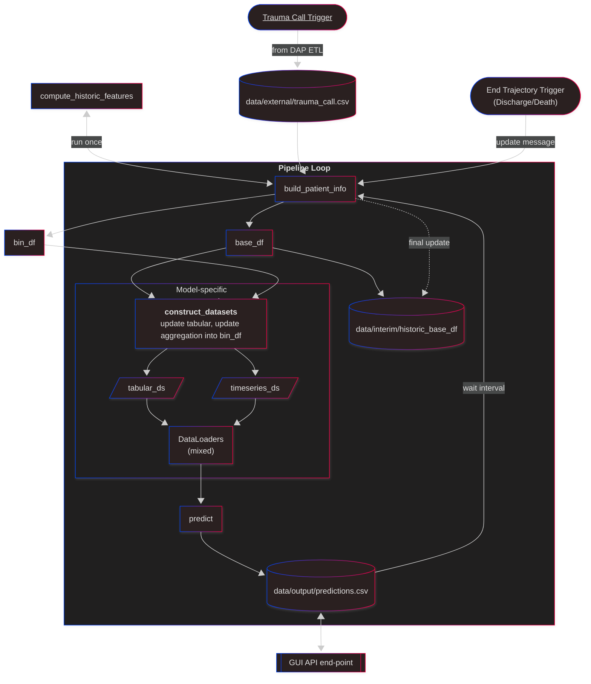
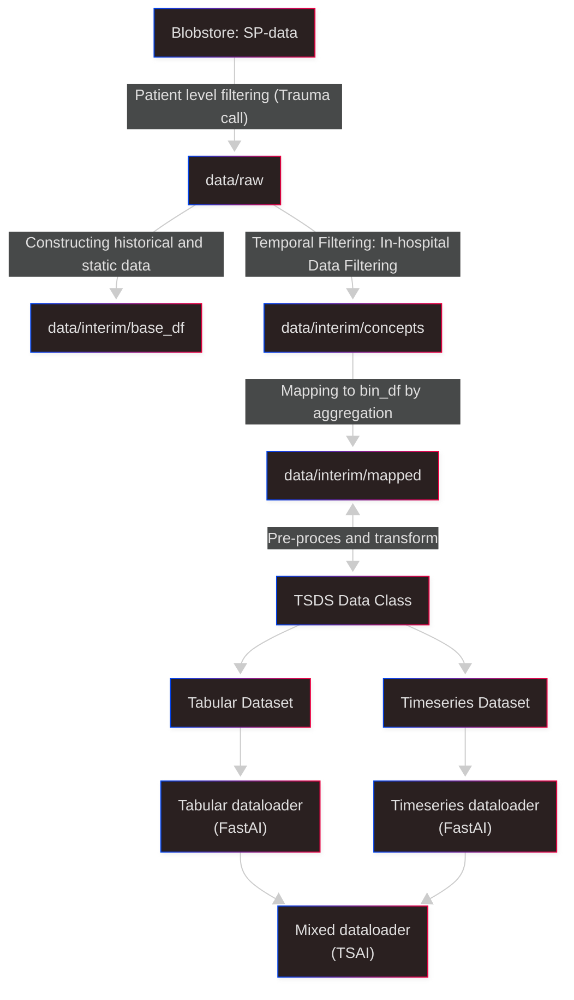
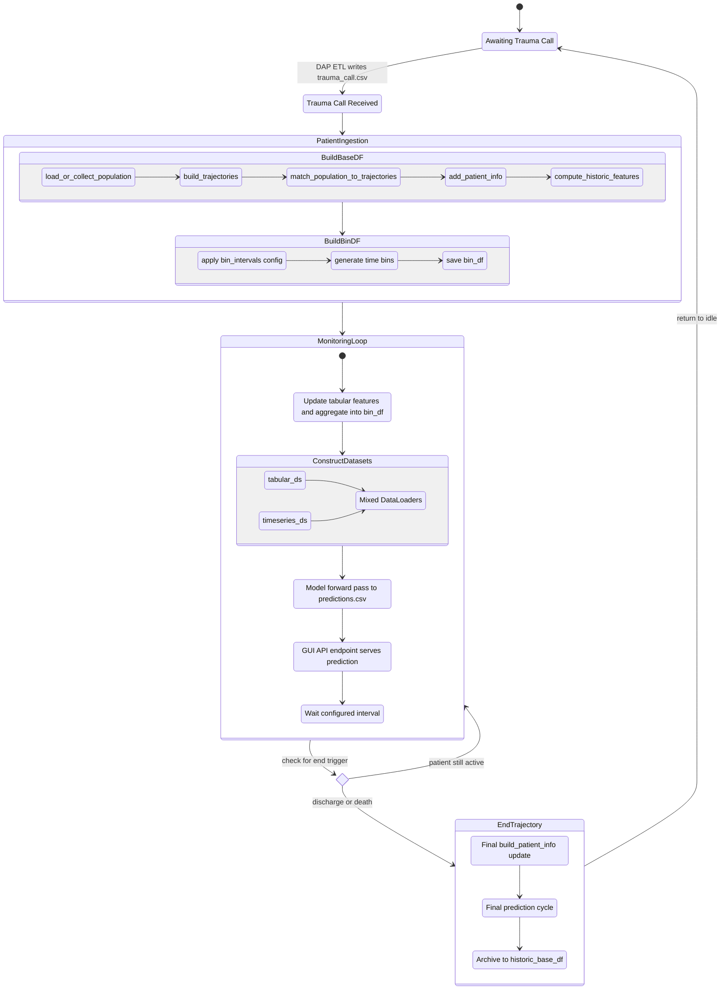

# ASTRA - AI for Surgical Trauma Risk Assessment
<i>Center for Surgical Translational and Artificial Intelligence Research (CSTAR), Copenhagen University Hospital, Denmark</i>

As a part of the ASTRA project by CSTAR, an ML-driven risk assessment tool for trauma patients is developed for implementation in the Eletronic Health Record (EHR) system at the Copenhagen University Hospital. 

> **Implementing ASTRA for inference?** Start with [docs/HANDOFF.md](docs/HANDOFF.md) — it covers the `AstraPredictor` Python API, the FastAPI reference service, the artifact bundle (`python -m astra.inference.export_artifacts`), and the normative per-concept data contract for wiring up your own EHR data feed. Then run `python scripts/demo_api_usage.py` — a self-contained end-to-end demo (synthetic model + synthetic patient, no artifacts or data needed).
>
> **Operating the full lifecycle** (new data dump → rebuild → retrain → evaluate → redeploy): [docs/RETRAINING.md](docs/RETRAINING.md).

### Single patient continious update process graph

### Historic data process graph

### Single patient lifecycle state diagram
