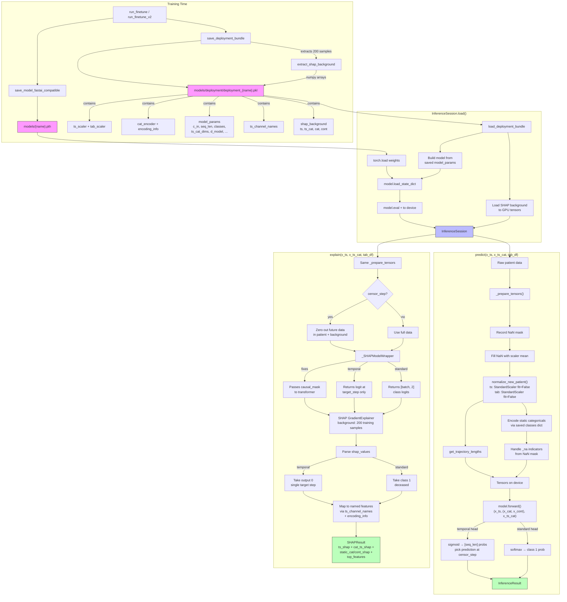

# Inference Pipeline Architecture

## Overview

The inference pipeline enables single-patient prediction and SHAP explanation using a trained ASTRA model. It consists of two phases: saving deployment artifacts at training time, and loading them at inference time to run predictions without the full data pipeline.

## Flow Diagram

## Key Files

| File | Role |
|------|------|
| `astra/inference/pipeline.py` | `InferenceSession`, `_SHAPModelWrapper`, result dataclasses |
| `astra/data/dataloader.py` | `save_deployment_bundle()`, `load_deployment_bundle()`, `normalize_new_patient()` |
| `astra/training/finetune.py` | Calls `save_deployment_bundle()` after v2 finetuning |
| `astra/inference/export_artifacts.py` | Export/validate the deployment artifact bundle (`validate` doubles as the end-to-end smoke test) |
