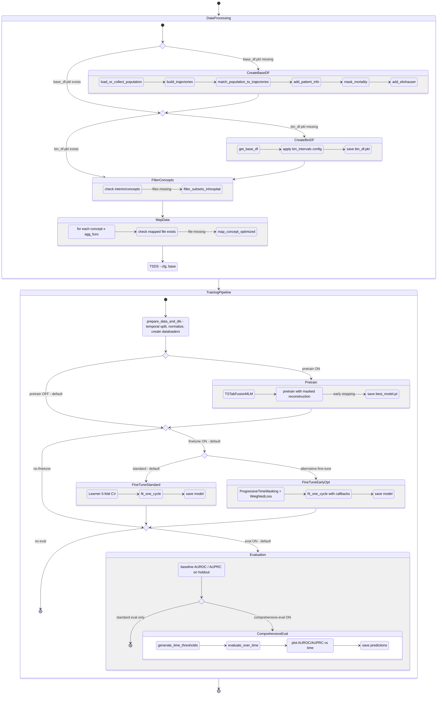

### Full pipeline state diagram

```mermaid
stateDiagram-v2
    direction TB

    [*] --> DataProcessing

    state DataProcessing {
        direction TB

        state base_check <<choice>>
        state bin_check <<choice>>

        [*] --> base_check
        base_check --> CreateBaseDF : base_df.pkl missing
        base_check --> bin_check : base_df.pkl exists

        state CreateBaseDF {
            direction LR
            pop : load_or_collect_population
            traj : build_trajectories
            match : match_population_to_trajectories
            info : add_patient_info
            mort : mask_mortality
            statics : add_elixhauser
            pop --> traj
            traj --> match
            match --> info
            info --> mort
            mort --> statics
        }

        CreateBaseDF --> bin_check

        bin_check --> CreateBinDF : bin_df.pkl missing
        bin_check --> FilterConcepts : bin_df.pkl exists

        state CreateBinDF {
            direction LR
            load_base : get_base_df
            gen_bins : apply bin_intervals config
            save_bin : save bin_df.pkl
            load_base --> gen_bins
            gen_bins --> save_bin
        }

        CreateBinDF --> FilterConcepts

        state FilterConcepts {
            direction LR
            check_interim : check interim/concepts
            filter_hospital : filter_subsets_inhospital
            check_interim --> filter_hospital : files missing
        }

        FilterConcepts --> MapData

        state MapData {
            direction LR
            iterate : for each concept x agg_func
            check_mapped : check mapped file exists
            map_opt : map_concept_optimized
            iterate --> check_mapped
            check_mapped --> map_opt : file missing
        }

        MapData --> BuildTSDS
        BuildTSDS : TSDS - cfg, base
    }

    DataProcessing --> TrainingPipeline

    state TrainingPipeline {
        direction TB

        state pretrain_flag <<choice>>
        state finetune_flag <<choice>>
        state eval_flag <<choice>>
        state finetune_method <<choice>>

        [*] --> PrepareData
        PrepareData : prepare_data_and_dls - temporal split, normalize, create dataloaders

        PrepareData --> pretrain_flag

        pretrain_flag --> Pretrain : pretrain ON
        pretrain_flag --> finetune_flag : pretrain OFF - default

        state Pretrain {
            direction LR
            build_mlm : TSTabFusionMLM
            run_mlm : pretrain with masked reconstruction
            save_pt : save best_model.pt
            build_mlm --> run_mlm
            run_mlm --> save_pt : early stopping
        }

        Pretrain --> finetune_flag

        finetune_flag --> finetune_method : finetune ON - default
        finetune_flag --> eval_flag : no-finetune

        finetune_method --> FineTuneStandard : standard - default
        finetune_method --> FineTuneEarlyOpt : alternative-fine-tune

        state FineTuneStandard {
            direction LR
            ft_learn : Learner 5-fold CV
            ft_train : fit_one_cycle
            ft_save : save model
            ft_learn --> ft_train
            ft_train --> ft_save
        }

        state FineTuneEarlyOpt {
            direction LR
            epo_cbs : ProgressiveTimeMasking + WeightedLoss
            epo_train : fit_one_cycle with callbacks
            epo_save : save model
            epo_cbs --> epo_train
            epo_train --> epo_save
        }

        FineTuneStandard --> eval_flag
        FineTuneEarlyOpt --> eval_flag

        eval_flag --> Evaluation : eval ON - default
        eval_flag --> [*] : no-eval

        state Evaluation {
            direction TB

            state comp_check <<choice>>

            baseline : baseline AUROC / AUPRC on holdout
            baseline --> comp_check

            comp_check --> ComprehensiveEval : comprehensive-eval ON
            comp_check --> [*] : standard eval only

            state ComprehensiveEval {
                direction LR
                gen_thresh : generate_time_thresholds
                eval_time : evaluate_over_time
                plot_met : plot AUROC/AUPRC vs time
                save_preds : save predictions
                gen_thresh --> eval_time
                eval_time --> plot_met
                plot_met --> save_preds
            }
        }
    }

    TrainingPipeline --> [*]
```
