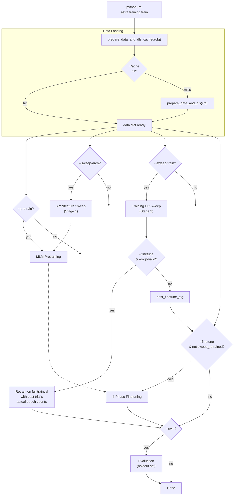
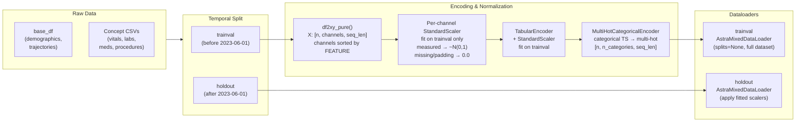
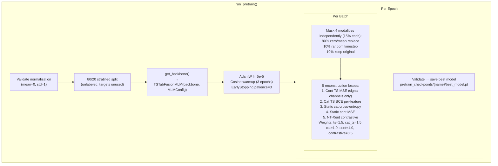
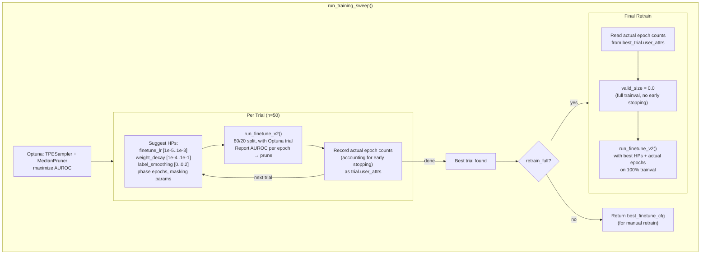
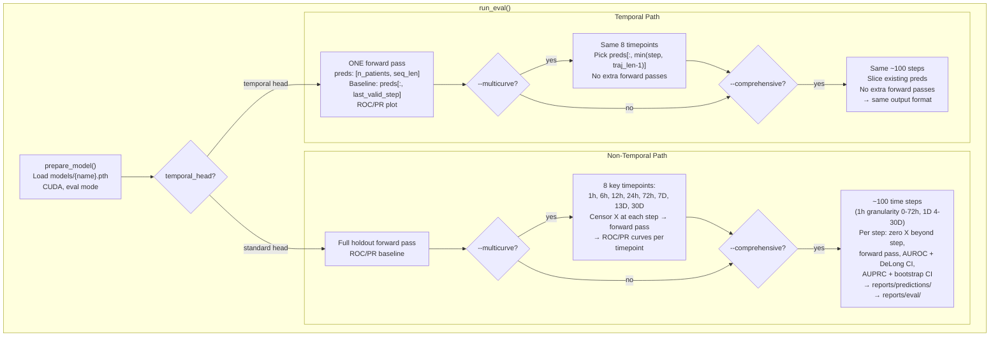

# ASTRA Training Pipeline

## CLI Usage

```bash
# Full pipeline: pretrain → finetune on full trainval → eval
python -m astra.training.train --pretrain --finetune --eval

# Full pipeline with HP sweep: pretrain → HPO → retrain on full trainval → eval
python -m astra.training.train --pretrain --sweep-train --finetune --eval

# Finetune only (existing pretrained checkpoint, full trainval)
python -m astra.training.train --finetune --eval

# Finetune with 80/20 validation split + early stopping
python -m astra.training.train --finetune --no-skip-valid --eval

# Architecture sweep (Stage 1)
python -m astra.training.train --sweep-arch --n-arch-trials 30

# Training HP sweep only (no final retrain)
python -m astra.training.train --sweep-train --no-finetune --n-train-trials 50

# Comprehensive time-dependent evaluation
python -m astra.training.train --no-finetune --eval --comprehensive-eval --multicurve
```

## Pipeline Overview



## Data Pipeline



## MLM Pretraining



## 4-Phase Finetuning

```mermaid
flowchart TD
    subgraph FINETUNE["run_finetune_v2()"]
        BACKBONE{"use_pretrained?"}
        LOAD_PT["load_pretrained_backbone()\nLoad checkpoint → extract backbone\nExpand W_P if c_in mismatch\nstrict=False if temporal_head"]
        FRESH["get_backbone()\nRandom init"]

        BACKBONE -- yes --> LOAD_PT --> DL_MODE
        BACKBONE -- no --> FRESH --> DL_MODE

        DL_MODE{"skip-valid?\n(valid_size ≤ 0)"}
        FULL["Full trainval\nvalid_dl = None\nNo early stopping"]
        SPLIT["80/20 stratified split\nEarlyStopping patience=7"]

        DL_MODE -- "default: yes" --> FULL
        DL_MODE -- "--no-skip-valid" --> SPLIT

        FULL --> P1
        SPLIT --> P1

        P1["Phase 1: Head-only\nfreeze all but classification head\n5 epochs, lr=1e-3"]
        P2["Phase 2: Partial unfreeze\nupper transformer layers + head\n12 epochs, lr=3e-4\ndiscriminative LRs (decay=0.1)"]
        P3["Phase 3: Full finetune\nall layers trainable\n8 epochs, lr=1e-4\ndiscriminative LRs"]
        P4_Q{"--early-prediction?"}
        P4["Phase 4: Early prediction hardening\n8 epochs, lr=5e-5\nprogressive time masking (prob=0.5)\nweighted loss (sparse data → higher weight)"]

        P1 --> P2 --> P3 --> P4_Q
        P4_Q -- yes --> P4 --> SAVE
        P4_Q -- no --> SAVE

        SAVE_Q{"Had validation?"}
        SAVE_Q -- yes --> RESTORE["EarlyStopping.restore_best()\nRevert to best checkpoint\nacross all phases"]
        SAVE_Q -- no --> FINAL["Use final model state"]

        SAVE --> SAVE_Q
        RESTORE --> MODEL_SAVE
        FINAL --> MODEL_SAVE

        MODEL_SAVE["save_model() → models/{name}.pth\nsave_deployment_bundle()\n→ models/deployment/deployment_{name}.pkl"]
    end
```



## HP Sweep → Retrain Flow



## Evaluation



## Key Configuration (defaults.yaml)

| Parameter | Default | Section |
|---|---|---|
| Pretrain epochs | 3 | `pretrain.epochs` |
| Pretrain lr | 5e-5 | `pretrain.lr` |
| Phase 1 epochs / lr | 5 / 1e-3 | `finetune.phase1_*` |
| Phase 2 epochs / lr | 12 / 3e-4 | `finetune.phase2_*` |
| Phase 3 epochs / lr | 8 / 1e-4 | `finetune.phase3_*` |
| Phase 4 epochs / lr | 8 / 5e-5 | `finetune.phase4_*` |
| Validation size | 0.2 | `finetune.valid_size` |
| Early stopping patience | 7 | `finetune.patience` |
| LR decay factor | 0.1 | `finetune.lr_decay_factor` |
| Label smoothing | 0.1 | `finetune.label_smoothing` |
| Holdout split date | 2023-06-01 | `holdout_split_date` |
| Batch size | 64 | `training.bs` |
